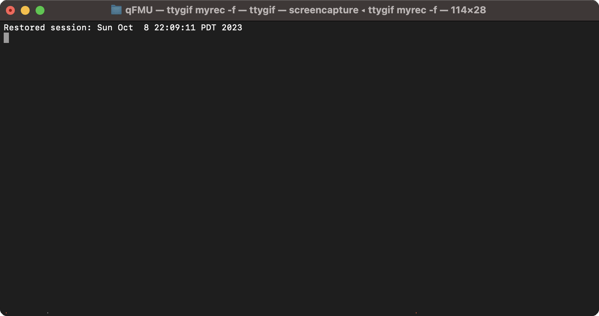

<p align="center">
  
</p>

---

**qfmu** is a python package to generate `continuous-time`, `LTI` system FMUs from command line.



## Installation
Install `qfmu` through PyPI

```
pip install qfmu
```

*Noted* that a C compiler is required

- `msvc` for Windows
- `gcc` for Linux
- `clang` for MacOS

## Features

Currently, qfmu is able to generate fmus that are compliant with **FMI2** standard. 

The following models are supported:

| Model              	| ME 	| CS 	|
|--------------------	|----	|----	|
| State Space       	| ✔️  | ✔️ 	|
| Transfer Function 	| ✔️  | ✔️ 	|
| PID               	| ✔️  | ✔️ 	|

*Noted* that only continuous-time models are supported currently.

## Examples

Generate a continuous-time state space FMU

```bash
qfmu ss -A "[[1,2],[3,4]]" -B "[[1],[2]]" -C "[[1,0],[0,1]]" -x0 "[3.14, 6]" -o ./q.fmu
```

If `qfmu` is installed properly, you should see a `q.fmu` file generated in your current working directory.

If you have `fmpy` installed, you can run `fmpy info q.fmu` to see detailed model information.

```
Model Info

  FMI Version        2.0
  FMI Type           Model Exchange, Co-Simulation
  Model Name         q
  Description        None
  Platforms          c-code, linux64
  Continuous States  2
  Event Indicators   0
  Variables          10
  Generation Tool    qfmu
  Generation Date    2023-10-08 21:24:32.733857

Default Experiment

  Stop Time          1.0
  Tolerance          0.0001

Variables (input, output)

  Name               Causality              Start Value  Unit     Description
  u1                 input                          0.0           Model input 1
  y1                 output                                       Model output 1
  y2                 output                                       Model output 2
```

Generate a continuous-time transfer function FMU

```bash
qfmu tf --num "[1]" --den "[1,1]" -o ./q.fmu
```

Generate a continuous-time PID controller FMU

```bash
qfmu pid --kp=3.0 --ki=1 -o ./q.fmu
```